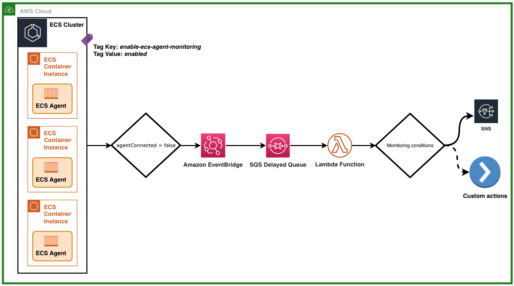

# ECS Agent Monitoring

Amazon Elastic Container Service [Amazon ECS](https://aws.amazon.com/ecs/) is a fully managed container orchestration service that allows organizations to deploy, manage and scale containerized workloads. It is deeply integrated with the AWS ecosystem in order to provide a secure and easy-to-use solution for managing applications not only in the cloud but now also on your infrastructure with [Amazon ECS Anywhere](https://aws.amazon.com/ecs/anywhere/).

Within Amazon ECS components, the ECS Agent is a vital piece which is in charge of all the communication between the ECS Container Instances and the ECS control plane logic. Among other tasks, the ECS Agent will register your ECS Container Instance within the ECS Cluster, receive instructions from the ECS Scheduler for placing, starting and stopping tasks, and also reporting Tasks and container status changes.

- [What does the solution offer ?](#what-does-the-solution-offer-)
- [How to deploy the solution](#how-to-deploy-the-solution)
- [Architecture](#architecture)
- [Project structure and template anatomy](#project-structure-and-template-anatomy)
- [Logging report using CloudWatch Logs Insights](#Logging-report-using-CloudWatch-Logs-Insights)
- [Considerations](#considerations)
- [Contributing to the project](#contributing-to-the-project)
- [Changelog](#changelog)
- [License](#license)

#### Security disclosures

If you think you’ve found a potential security issue, please do not post it in the Issues.  Instead, please follow the instructions [here](https://aws.amazon.com/security/vulnerability-reporting/) or email AWS security directly at [aws-security@amazon.com](mailto:aws-security@amazon.com).

## What does the solution offer ?

On this solution, we will combine AWS services such as Amazon EventBridge, Amazon Simple Queue Service (Amazon SQS), AWS Lambda, and Amazon Simple Notification Service (Amazon SNS) for delivering a simple setup capable of detecting and alerting about an ECS Agent disconnection issue.

As a part of its normal operation the Amazon ECS container agent disconnects and reconnects several times per hour. Considering this, several agent connection events should be expected without necessarily meaning there is an underlying issue going on. These events are not an indication that there is a problem with the container agent nor your container instance, but if the agent is never capable of re-connecting this can indeed be a clear sign of an on-going issue. This monitoring setup makes sure that an alert will be sent whenever the ECS Agent doesn't reconnect.


## How to deploy the solution

The solution deployment is fully automated with [CloudFormation](https://aws.amazon.com/cloudformation/). Before deploying, you will need to **pack** the templates, a process that will [upload local artifacts to an S3 bucket](https://docs.aws.amazon.com/AWSCloudFormation/latest/UserGuide/using-cfn-cli-package.html). This will consolidate the project templates for seamlessly deploying the solution.

Regarding the parameters, you will find self explanatory comments and parameter definitions while deploying the solution through the AWS Web Console.

### Step by step

1. Locate an S3 bucket, where CloudFormation templates will be stored. This Bucket **must** be in the same region were you will deploy the solution. If using Linux or MacOS, you can export the variables for smooth usage:

```
export the_region=<your-aws-region>
export the_bucket=<your-selected-s3-bucket>
```

2. Clone the repository

```
git clone https://github.com/aws-samples/amazon-ecs-agent-connection-monitoring
```

... or [download](https://github.com/aws-samples/amazon-ecs-agent-connection-monitoring/archive/master.zip) it directly as a zip.

3. Step into the repository folder

```
cd amazon-ecs-agent-connection-monitoring
```

- Package ...
```
aws --region=$the_region cloudformation package --template-file ./ecs-agent-monitoring.yaml --s3-bucket $the_bucket --output-template-file packaged-ecs-agent-monitoring.yaml
```

- Deploy ...

You can use the [AWS Web console to deploy](https://docs.aws.amazon.com/AWSCloudFormation/latest/UserGuide/cfn-console-create-stack.html)! Upload the **packaged-ecs-agent-monitoring.yaml** file. Alternatively, you can deploy via CLI as well:

```
aws --region=$the_region cloudformation create-stack \
       --template-body file://packaged-ecs-agent-monitoring.yaml \
       --stack-name <the-stack-name> \
       --disable-rollback \
       --capabilities CAPABILITY_AUTO_EXPAND CAPABILITY_NAMED_IAM
```


## Architecture

The monitoring setup is provisioned via CloudFormation. This will allow you to seamlessly deploy the required components with almost zero touch configuration. For the sake of understanding the different components and internals of the design, please refer to the architecture diagram below.



## Project structure and template anatomy

The project structure uses [CloudFormation Stacks](https://aws.amazon.com/cloudformation/) for seamlessly deploying the solution.

The project structure looks as follows:

```
.
├── CHANGELOG.md
├── CODE_OF_CONDUCT.md
├── CONTRIBUTING.md
├── LICENSE
├── README.md
├── code
│   ├── __init__.py
│   ├── commonlib
│   │   ├── __init__.py
│   │   └── commonlib.py
|   |   └── ** .py files for the libraries **
│   └── lambda_event_bridge_monitor.py
└── ecs-agent-monitoring.yaml
```

## Logging report using CloudWatch Logs Insights

The Lambda Function generates logs for each action that it is doing. One of them is about the detection of an issue with a specific Container Instance ECS Agent. You can open the CloudWatch log group from the Logs insights console and use the below [CloudWatch Logs Insights query](https://docs.aws.amazon.com/AmazonCloudWatch/latest/logs/CWL_QuerySyntax.html) to have a report of how many ECS Container Instances had issues for a given time:

```
filter @message like 'ISSUE'
| stats count(*) as Total
```


## Considerations

We encourage everyone to report issues and feature requests in [this section](https://github.com/aws-samples/amazon-ecs-agent-connection-monitoring/issues). This will help to improve the solution and expand it to different use cases.

- This solution works both for Linux and Windows ECS Instances.
- It also works with [External instances (Amazon ECS Anywhere)](https://docs.aws.amazon.com/AmazonECS/latest/developerguide/ecs-anywhere.html).
- You may want to expand the functionality and add your custom actions on the affected EC2 Instances.


## Contributing to the project

Contributions and feedback are welcome! Proposals and pull requests will be considered and responded. For more information, see the [CONTRIBUTING](./CONTRIBUTING.md) file.

Amazon Web Services does not currently provide support for modified copies of this software.


## Changelog

Refer to the [Changelog section](./CHANGELOG.md).


## License

The Amazon ECS agent connection monitoring solution is distributed under the [MIT-0 License](https://github.com/aws/mit-0). See [LICENSE](./LICENSE) for more information.
